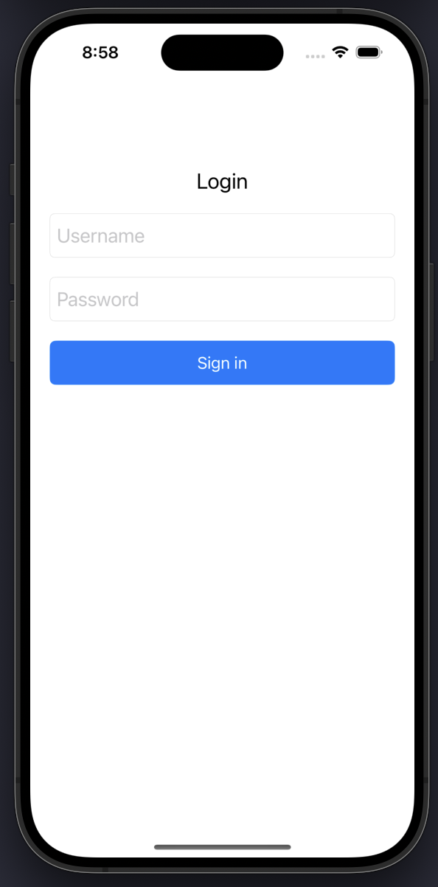
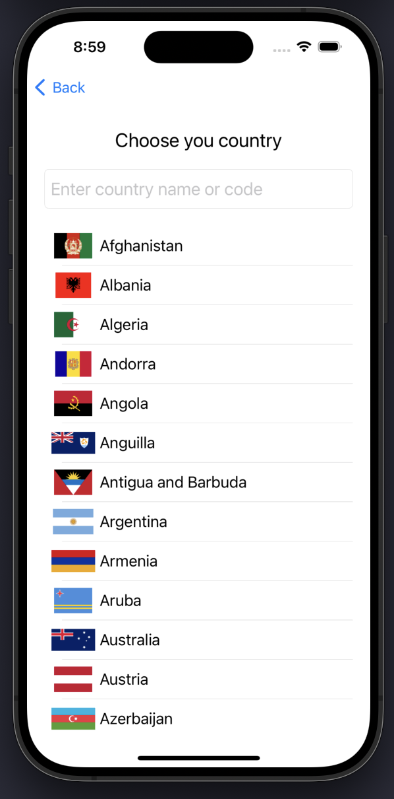
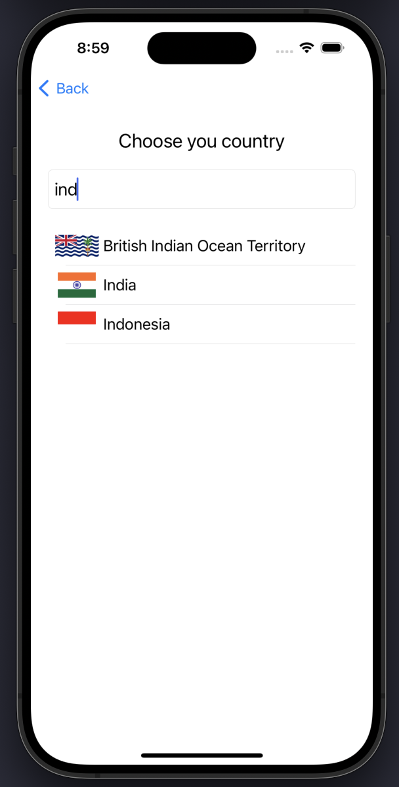

# GlobeFlags

GlobeFlags is an iOS project developed for interview purposes. It demonstrates key iOS development skills including fetching a dynamic list of countries via an API using Alamofire, loading and displaying country flag images (supporting both SVG and PNG formats) using SDWebImage, and simulating user authentication with a static login screen.

## Features

- **Dynamic Country List:**  
  The app fetches country data (including country names and flag image URLs) from a remote API using Alamofire.

- **Flag Image Support:**  
  Uses SDWebImage to load and cache flag images efficiently, handling both SVG and PNG formats.

- **Static Login Screen:**  
  A simple login interface is provided to simulate user authentication.

- **Clean Architecture:**  
  Demonstrates best practices in Swift development and UI design.

## Screenshots

<p align="center">
  
  
  
</p>

## Requirements

- iOS 13 or later
- Xcode 12 or later
- Swift 5
- [Alamofire](https://github.com/Alamofire/Alamofire) (for API calls)
- [SDWebImage](https://github.com/SDWebImage/SDWebImage) (for image loading and caching)

## Installation

1. **Clone the Repository:**

   ```bash
   git clone https://github.com/saeed-mohammad/GlobeFlags.git
